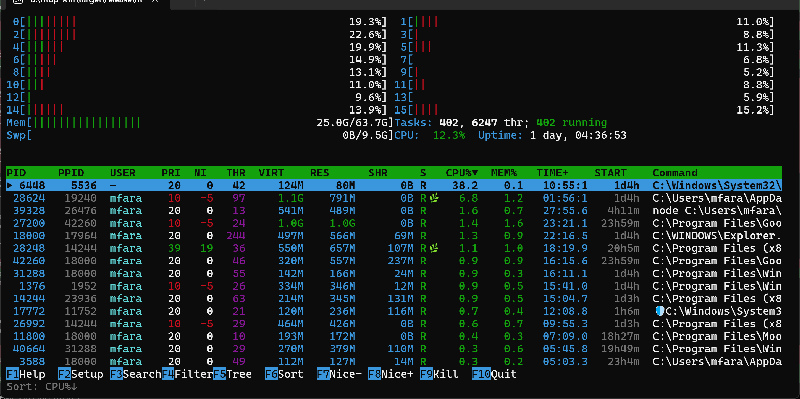

# htop-win

A Windows clone of [htop](https://htop.dev/) - interactive process viewer written in Rust.


[](https://opensource.org/licenses/MIT)

> Inspired by the original [htop](https://github.com/htop-dev/htop) by Hisham Muhammad and contributors.



## Features

- **Real-time system monitoring**
  - Per-core CPU usage bars with color gradients
  - Memory and swap usage bars
  - Process count and uptime display

- **Interactive process list**
  - Sortable by any column (PID, CPU%, MEM%, etc.)
  - Search and filter processes
  - Tree view showing parent-child relationships
  - Process tagging for batch operations

- **Process management**
  - Kill processes (F9)
  - Change process priority
  - View detailed process information

- **Full mouse support**
  - Click to select processes
  - Click column headers to sort
  - Scroll wheel navigation

## Keyboard Shortcuts

| Key | Action |
|-----|--------|
| `F1` / `?` | Help |
| `F2` / `S` | Setup menu |
| `F3` / `/` | Search |
| `F4` / `\` | Filter |
| `F5` / `t` | Toggle tree view |
| `F6` / `>` | Select sort column |
| `F7` | Decrease priority |
| `F8` | Increase priority |
| `F9` | Kill process |
| `F10` / `q` | Quit |
| `↑` `↓` `j` `k` | Navigate |
| `PgUp` `PgDn` | Page navigation |
| `Home` `End` | Jump to first/last |
| `Space` | Tag/untag process |
| `u` | Untag all |
| `Enter` | Process details |
| `n` / `N` | Find next/previous |

## Building

```bash
# Debug build
cargo build

# Release build (optimized)
cargo build --release
```

## Running

```bash
# Run debug version
cargo run

# Run release version
cargo run --release

# Or run the binary directly
./target/release/htop-win.exe
```

## Requirements

- Windows 10 or later
- Rust 1.85+ (edition 2024)

## Dependencies

Minimal dependency set for small binary size (~500KB):
- [crossterm](https://github.com/crossterm-rs/crossterm) - Terminal manipulation
- [windows](https://github.com/microsoft/windows-rs) - Direct Windows API bindings
- Custom terminal UI library (no ratatui)
- Custom JSON parser (no serde)

## License

MIT License
